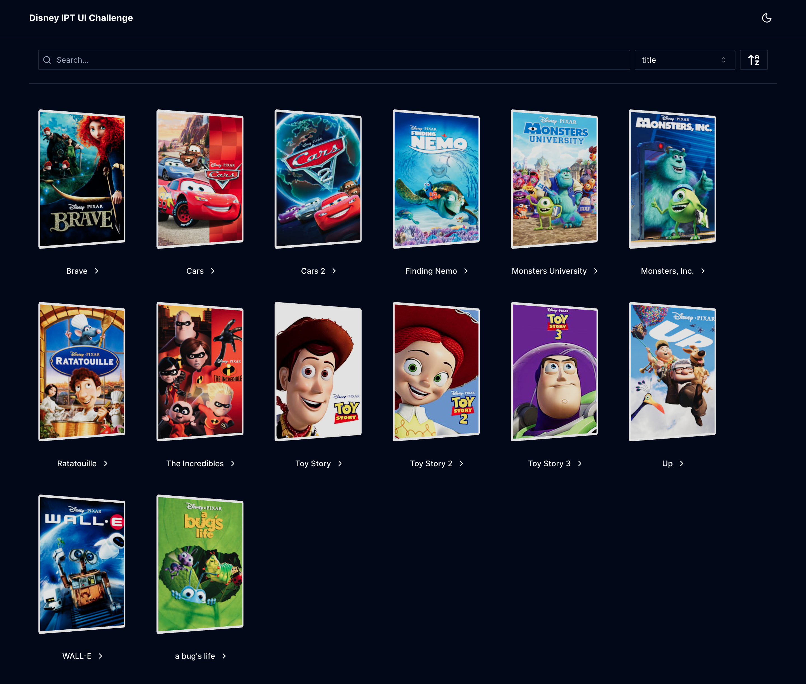
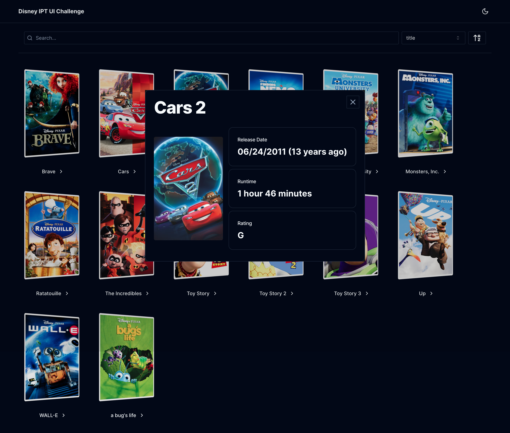

# UI Challenge




## Building

### Prerequisites

Use [Bun](https://github.com/oven-sh/bun?tab=readme-ov-file#install) (recommended) or Node/npm to build the project.

### Installing dependencies

```sh
bun install
```

### Building with Bun

```sh
bun run build && bun run start
```

### Running development server

```sh
bun run dev
```
